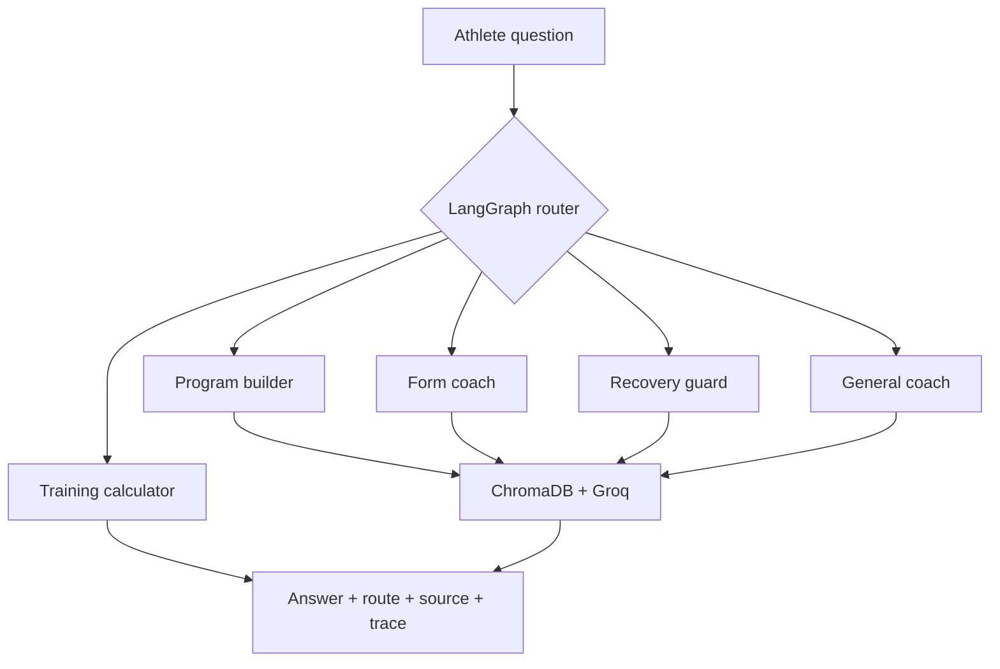

# AURA FIT — AI Training Coach

AURA FIT is a polished agentic AI gym assistant that answers workout questions,
explains exercise technique, estimates training numbers, supports recovery
decisions and builds personalised workout plans. It was created as a practical
fitness use case for the MCE Agentic AI Development Workshop.

**Public demo:** [https://mce-agentic-ai.kruthajn777.chatgpt.site](https://mce-agentic-ai.kruthajn777.chatgpt.site)

**Source repository:** [github.com/krutharth-dev/aura-fit-ai](https://github.com/krutharth-dev/aura-fit-ai)

> AURA FIT provides educational fitness guidance. It does not diagnose injuries
> or replace a doctor, physiotherapist, dietitian or qualified in-person coach.

## How the agent works



## Workshop technology mapping

| Workshop topic | AURA FIT implementation |
|---|---|
| Agent architecture | Five specialist routes with conditional decisions |
| Groq and prompting | Server-side fitness coaching prompt and live responses |
| LangGraph | Stateful routing graph with thread memory |
| ChromaDB | Persistent exercise and programming knowledge base |
| Evaluation/deployment | Safety tests, route tests, trace output and hosted UI |

## Features

- Premium responsive gym-chat interface
- Multi-turn body-part workout builder that remembers the selected muscle group, asks for an exercise count, and returns exactly that many movements
- Uniform offline-safe coverage for back, chest, shoulders, legs, quads, hamstrings, glutes, biceps, triceps, arms, core, calves, forearms and full body
- Workout-plan generator that considers goal, experience, days, time, equipment and limitations
- Exercise form answers with setup, execution, common errors and regressions
- Common gym answers covering warm-ups, rest periods, sets and reps, exercise order, frequency, cardio, failure, progression and substitutions
- Recovery route with conservative pain and red-flag safety handling
- Deterministic 1RM estimator and safe arithmetic tool
- Groq-powered live coaching when an API key is present
- LangGraph routing and ChromaDB retrieval in the Python backend
- Conversation memory plus visible route and source labels
- Demo-safe mode that works without an API key
- macOS, Windows and Ubuntu setup scripts
- Automated routing, safety, calculator and program tests

## Fastest demonstration

Open the hosted project. It automatically uses demo-safe mode when no Groq key
is configured. Try these prompts:

1. `I want to train back today.` Then answer `six` when AURA FIT asks how many exercises you want.
2. `Give me 4 chest exercises.` — demonstrates a direct body-part request.
3. `How long should I rest between sets for muscle growth?`
4. `Create a 4-day muscle-building plan for an intermediate lifter with full gym access and 60-minute sessions.`
5. `Explain the main squat form cues and common mistakes.`
6. `Estimate my 1RM from 100 kg × 5 reps.`
7. `My legs are still sore two days after training. Should I train them again?`

## Full local setup

### Requirements

- Node.js 22 or newer
- Python 3.11 or 3.12
- Git
- A free Groq API key for live open-ended responses

### macOS or Ubuntu

```bash
git clone https://github.com/krutharth-dev/aura-fit-ai.git
cd aura-fit-ai
npm install
npm run setup:agent
cp .env.example .env.local
```

Open `.env.local`, paste your Groq key after `GROQ_API_KEY=`, then run:

```bash
npm run dev:full
```

### Windows PowerShell

```powershell
git clone https://github.com/krutharth-dev/aura-fit-ai.git
cd aura-fit-ai
npm install
npm run setup:agent
Copy-Item .env.example .env.local
npm run dev:full
```

Open the URL printed by Vite, normally
[http://localhost:5173](http://localhost:5173). Press `Ctrl+C` to stop both
services.

Never put a Groq key in the browser chat or commit `.env.local` to GitHub.

## Terminal-only demo

```bash
# macOS / Ubuntu — from the repository root
cd python_agent
../.venv/bin/python -m app.cli
```

On Windows, run `..\.venv\Scripts\python.exe -m app.cli` from the
`python_agent` folder.

## Tests

```bash
npm test

# macOS / Ubuntu
.venv/bin/python -m unittest discover -s python_agent/tests -v

# Windows
.venv\Scripts\python.exe -m unittest discover -s python_agent/tests -v
```

## Python API

The agent service starts at `http://127.0.0.1:8000`.

- `GET /health` — reports LangGraph, ChromaDB and live/demo status
- `POST /chat` — accepts a message, recent history and thread ID
- `GET /docs` — interactive FastAPI documentation

Example:

```json
{
  "message": "Explain squat form",
  "history": [],
  "thread_id": "gym-demo"
}
```

## Two-minute viva explanation

“AURA FIT is more than a normal chatbot. Each question enters a LangGraph state
machine. A router decides whether the athlete needs a program builder, exercise
form coach, recovery safety guard, training calculator or general coach.
Exercise and programming questions retrieve relevant guidance from a persistent
ChromaDB collection, then Groq can generate a grounded response. The system
returns the selected route, source and execution trace for observability. If the
API or internet is unavailable, local tools preserve the core demonstration.”

## Project structure

```text
app/                     Gym chat interface and secure server endpoint
python_agent/app/        LangGraph router, fitness tools, ChromaDB and FastAPI
python_agent/data/       Local exercise and programming knowledge base
python_agent/tests/      Route, safety, calculator and plan tests
scripts/                 Cross-platform setup and start scripts
.env.example             Safe configuration template
DEMO_GUIDE.md            Three-minute demo and viva preparation
```

## Submission checklist

- Replace both team placeholders below with names, USNs and section before submission.
- Test the public demo in a private/incognito window and on a second device.
- Test the suggested body-part, FAQ, plan, form, calculator and recovery prompts.
- Keep `.env.local` private.
- Carry the ZIP in Google Drive or on a USB drive.
- Keep the hosted link ready as the first demonstration option.

---

Built as a fitness-focused Agentic AI project for the MCE Department of
Computer Science and Engineering workshop, August 2026.

## Project team

1. **Team member 1:** Name / USN / section to be added
2. **Team member 2:** Name / USN / section to be added
