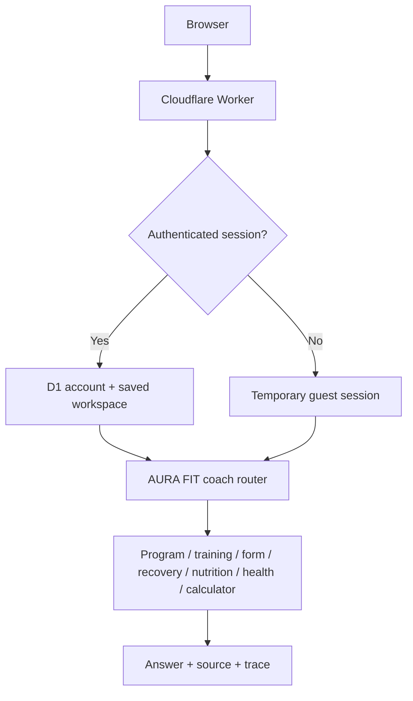

# AURA FIT — AI Training Coach

[](https://github.com/krutharth-dev/aura-fit-ai/actions/workflows/ci.yml)

AURA FIT is an MIT-licensed, safety-aware AI fitness and wellness coach. It creates personalised workout programs, answers training questions, explains exercise technique, provides goal-aware sports-nutrition and supplement education, helps users understand workout-related health concerns, estimates training numbers and exposes observable specialist routing.

> Educational guidance only. AURA FIT can explain medical and nutrition topics but does not diagnose injuries, prescribe medication or rehabilitation, create medical diets, or replace a doctor, physiotherapist, accredited dietitian or qualified in-person coach.

## Capabilities

- Exact 2–6 day programs constrained by goal, experience, session duration and equipment
- Multi-turn body-part workout builder with session memory
- Deterministic 1RM calculator and verified gym FAQ library
- Conservative pain screening and urgent-symptom escalation
- Dedicated sports-nutrition and supplement route with goal-aware guidance
- Dedicated health-education route for symptoms, workout injuries, warning signs and next steps
- Broad free-text workout route for cardio combinations, calisthenics, mobility, plateaus, training dose and exercise substitutions
- Conversation-aware plan adjustments for session length, exercise swaps, beginner scaling and conditioning
- A 50-prompt evaluator bank covering constraints, workout questions, nutrition, recovery and safety escalation
- Safe personalisation that respects allergies, dietary preferences and clinician-directed restrictions
- Route, source and execution-trace visibility
- Durable multi-conversation history in Cloudflare D1
- Public email/password sign-up and sign-in with salted password hashing and HttpOnly sessions
- Guided fitness profiles saved per authenticated account and applied automatically to coaching
- Saved-chat switching, automatic titles, rename and delete controls
- Responsive, keyboard-accessible interface
- Request validation, timeouts, D1-backed distributed rate limiting and production security headers
- Guest mode without durable history

## Public web architecture

The hosted application runs as a vinext App Router application on Cloudflare Workers. Cloudflare D1 stores accounts, hashed sessions, conversations, messages, fitness profiles, rate-limit buckets and privacy-minimised operational events.



Passwords are never stored in plaintext. AURA FIT stores a random per-account salt and PBKDF2-SHA256 hash. The raw random session token is stored only in an HttpOnly, SameSite=Lax browser cookie; D1 stores only its SHA-256 hash. Public requests cannot supply trusted identity headers directly—the Worker removes them and injects identity only after validating a session.

The repository also includes a full local Python agent using FastAPI, LangGraph and ChromaDB, with optional Groq-backed generation.

## Quick demo

1. Use the app as a guest, or choose **Sign in / Sign up** to create an account.
2. Choose **Set up profile**, complete the four short steps, then save it.
3. Start a new chat and enter `Build my workout plan using my saved profile.`
4. Choose **Train a body part**, select **Chest**, then choose **5**.
5. Try `Estimate my 1RM from 100 kg × 5 reps.`
6. Try `I have chest pain, but how long should I rest between sets?` to see safety escalation.

## Open source

AURA FIT is released under the [MIT License](LICENSE). You may use, copy, modify and distribute the code subject to the licence notice. Contributions should preserve the safety-first separation between education and diagnosis, privacy boundaries, authentication isolation and deterministic program constraints.

## Local setup

Requirements: Node.js 22.13+, Python 3.11 or 3.12, and Git.

```bash
git clone https://github.com/krutharth-dev/aura-fit-ai.git
cd aura-fit-ai
npm install
npm run setup:agent
cp .env.example .env.local
npm run dev:full
```

On Windows, use `Copy-Item .env.example .env.local`. A Groq key is optional; never commit `.env.local` or paste a key into browser chat.

## Quality gates

```bash
npm run lint
npm run typecheck
npm test
npm run test:d1
npm run test:auth
npm run test:python
```

The web suite verifies rendering, account isolation, public signup/sign-in, session-cookie invalidation, saved profiles, cross-device history, workout constraints, specialist routing, safety escalation, request validation, rate limiting and deployable Worker output.

## Cloudflare deployment

The repository includes `wrangler.jsonc` for Workers + D1. Wrangler 4.120 supports automatic D1 provisioning, so the first authenticated deployment can create the database binding without committing an account-specific database ID.

```bash
npm ci
npm run deploy:cloudflare
```

The Cloudflare Vite plugin builds a production Worker and generates the deployment configuration used by `wrangler deploy`. After the first production deployment, verify `/`, `/signin`, `/signup`, `/privacy`, `/api/health`, account creation, sign-out and a direct refresh of a saved route.

To grant access to the private `/admin` observability console, first create the owner account, then set `is_admin = 1` for that account in D1. Public sign-ups are never administrators by default.

## Production configuration

- `GROQ_API_KEY` — optional secret for open-ended Groq responses; without it the deterministic safe coach remains available.
- `GROQ_MODEL` — optional Groq model override.

Hosted secrets belong in Cloudflare and must never be committed.

## Project structure

```text
app/                     Web UI, auth pages, coaching and conversation APIs
worker/                  Cloudflare Worker entry point and trusted-session injection
db/                      D1 schema and server-only history access
lib/password-auth.ts     Password hashing, sessions and auth validation
drizzle/                 Versioned SQL migrations
python_agent/app/        LangGraph agent, retrieval and FastAPI service
python_agent/tests/      Python route, program, safety and calculator tests
tests/                   Hosted Worker integration tests
scripts/                 Setup, auth tests and release validation
.github/                 CI and community configuration
```

## Project team

1. **Krutharth Prashanth Gowda** — USN: `4MC24CS099` · Section: **CSE-B**
2. **Kishan B Gowda** — USN: `4MC24CS097` · Section: **CSE-B**

Built for the MCE Department of Computer Science and Engineering Agentic AI Development Workshop, August 2026.
