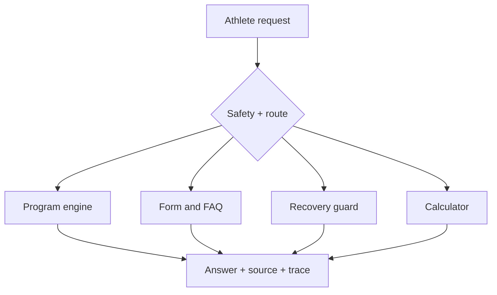

# AURA FIT — AI Training Coach

[](https://github.com/krutharth-dev/aura-fit-ai/actions/workflows/ci.yml)

AURA FIT is a safety-aware agentic fitness coach that creates personalised workout programs, answers gym questions, explains exercise technique, estimates training numbers and demonstrates observable specialist routing.

**Live demo:** [mce-agentic-ai.kruthajn777.chatgpt.site](https://mce-agentic-ai.kruthajn777.chatgpt.site)

> Educational fitness guidance only. AURA FIT does not diagnose injuries or replace a doctor, physiotherapist, dietitian or qualified in-person coach.

## Capabilities

- Exact 2–6 day programs constrained by goal, experience, session duration and equipment
- Multi-turn body-part workout builder with session memory
- Deterministic 1RM calculator and verified gym FAQ library
- Conservative pain screening and urgent-symptom escalation
- Route, source and execution-trace visibility
- Durable multi-conversation history in Cloudflare D1
- Managed ChatGPT sign-in/sign-up with account-owned, cross-device history
- Guided fitness profiles saved per account or guest device and applied automatically to coaching
- Saved-chat switching, automatic titles, rename and delete controls
- Six purpose-built coaching workflows and searchable conversation history
- Responsive, keyboard-accessible hosted interface
- Request validation, timeouts, D1-backed distributed rate limiting and production security headers
- Demo-safe behavior without secrets or third-party availability

## Two operating modes

| Mode | Runtime | Purpose |
|---|---|---|
| Hosted app | TypeScript coach + ChatGPT identity + Cloudflare D1 | Reliable coaching with secure account sync and guest mode |
| Full local agent | FastAPI + LangGraph + ChromaDB + optional Groq | Complete workshop architecture and open-ended generation |

The hosted app does not pretend that the Python agent is running. Its **How it works** panel clearly separates the two modes. Guests receive an anonymous, secure browser workspace. Users who continue with ChatGPT receive account-owned history and a fitness profile that follow them across signed-in devices without AURA FIT storing passwords; guest chats and the guest profile from the signing-in browser are safely attached to that account.

## Architecture



The local backend additionally uses LangGraph for state transitions, ChromaDB for relevant fitness context and Groq for optional grounded refinement.

## Quick demo

1. Choose **Set up profile**, complete the four short steps, then save it.
2. Start a new chat and enter `Build my workout plan using my saved profile.` The coach applies the saved goal, schedule, session length, equipment, preferences and limitations.
3. Choose **Train a body part**, select **Chest** (or any available muscle group), then choose **5**. The coach builds exactly five profile-aware exercises for that selection.
4. `Explain the main squat form cues and common mistakes.`
5. `Estimate my 1RM from 100 kg × 5 reps.`
6. `I have chest pain, but how long should I rest between sets?`

## Local setup

Requirements: Node.js 22+, Python 3.11 or 3.12, and Git.

```bash
git clone https://github.com/krutharth-dev/aura-fit-ai.git
cd aura-fit-ai
npm install
npm run setup:agent
cp .env.example .env.local
npm run dev:full
```

On Windows, use `Copy-Item .env.example .env.local`. A Groq key is optional; never commit `.env.local` or paste a key into the browser chat.

## Quality gates

```bash
npm run lint
npm run typecheck
npm test
npm run test:d1
npm run test:python
npm audit --omit=dev
```

The test suite verifies saved-profile validation and guest-to-account adoption, profile-aware program generation, exact day counts, equipment and time constraints, limitation refusal, multi-turn memory, guest isolation, signed-in cross-device database sync, calculations, safety escalation, request validation, security headers and deployable Worker/database output.

## Project structure

```text
app/                     Hosted chat UI, coaching and conversation APIs
db/                      D1 schema and server-only history access
drizzle/                 Reviewed, versioned SQL migrations
python_agent/app/        LangGraph agent, retrieval and FastAPI service
python_agent/tests/      Python route, program, safety and calculator tests
tests/                   Hosted Worker integration tests
scripts/                 Cross-platform setup and release validation
.github/                 CI and dependency update configuration
DEMO_GUIDE.md            Three-minute demonstration and viva guide
SECURITY.md              Vulnerability reporting and safety boundaries
```

## Project team

1. **Kishan B Gowda** — 4MC24CS097
2. **Krutharth Prashanth Gowda** — 4MC24CS099

Built for the MCE Department of Computer Science and Engineering Agentic AI Development Workshop, August 2026.
