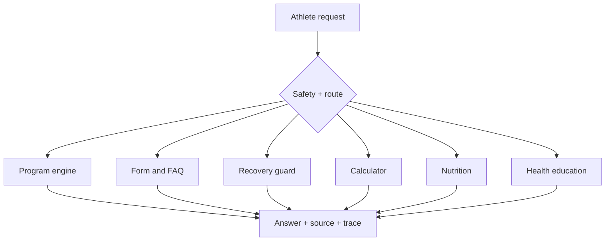

# AURA FIT — AI Training Coach

[](https://github.com/krutharth-dev/aura-fit-ai/actions/workflows/ci.yml)

AURA FIT is an MIT-licensed, safety-aware agentic fitness and wellness coach. It creates personalised workout programs, answers broad training questions, explains exercise technique, provides goal-aware sports-nutrition and supplement education, helps users understand workout-related health concerns, estimates training numbers and exposes observable specialist routing.

**Live demo:** [mce-agentic-ai.kruthajn777.chatgpt.site](https://mce-agentic-ai.kruthajn777.chatgpt.site)

> Educational guidance only. AURA FIT can explain medical and nutrition topics but does not diagnose injuries, prescribe medication or rehabilitation, create medical diets, or replace a doctor, physiotherapist, accredited dietitian or qualified in-person coach.

## Capabilities

- Exact 2–6 day programs constrained by goal, experience, session duration and equipment
- Multi-turn body-part workout builder with session memory
- Deterministic 1RM calculator and verified gym FAQ library
- Conservative pain screening and urgent-symptom escalation
- Dedicated sports-nutrition and supplement route with goal-aware guidance
- Dedicated health-education route for symptoms, workout injuries, warning signs and next steps
- Safe personalisation that respects allergies, dietary preferences and clinician-directed restrictions
- Route, source and execution-trace visibility
- Durable multi-conversation history in Cloudflare D1
- Managed ChatGPT sign-in/sign-up with account-owned, cross-device history
- Guided fitness profiles saved per authenticated account and applied automatically to coaching
- Saved-chat switching, automatic titles, rename and delete controls
- Eight purpose-built coaching workflows and searchable conversation history
- Responsive, keyboard-accessible hosted interface
- Request validation, timeouts, D1-backed distributed rate limiting and production security headers
- Demo-safe behavior without secrets or third-party availability

## Two operating modes

| Mode | Runtime | Purpose |
|---|---|---|
| Hosted app | TypeScript coach + ChatGPT identity + Cloudflare D1 | Reliable coaching with account-isolated history and temporary guest sessions |
| Full local agent | FastAPI + LangGraph + ChromaDB + optional Groq | Complete workshop architecture and open-ended generation |

The hosted app does not pretend that the Python agent is running. Its **How it works** panel clearly separates the two modes. Guests can use a temporary session without durable history. Users who continue with ChatGPT receive account-owned history and a fitness profile that follow them across signed-in devices without AURA FIT storing passwords. Every history operation is authorised server-side against a one-way account ownership key.

Privacy-safe first-party observability records aggregate page views, coaching routes, timing and sanitised error codes for up to 30 days. It never records chat text, email addresses, account identifiers, IP addresses or fitness details. The owner-only `/admin` console displays these operational signals, `/api/health` reports storage and coach mode, and `/privacy` contains the published policy.

## Architecture



The local backend additionally uses LangGraph for state transitions, ChromaDB for relevant fitness context and Groq for optional grounded refinement.

## Quick demo

1. Choose **Set up profile**, complete the four short steps, then save it.
2. Start a new chat and enter `Build my workout plan using my saved profile.` The coach applies the saved goal, schedule, session length, equipment, preferences and limitations.
3. Choose **Train a body part**, select **Chest** (or any available muscle group), then choose **5**. The coach builds exactly five profile-aware exercises for that selection.
4. `Explain the main squat form cues and common mistakes.`
5. `Estimate my 1RM from 100 kg × 5 reps.`
6. `I have chest pain, but how long should I rest between sets?`
7. `How much protein should I eat for muscle gain?`
8. `Could my swollen ankle be a workout injury?`

## Open source

AURA FIT is released under the [MIT License](LICENSE). You may use, copy, modify and distribute the code subject to the licence notice. Contributions should preserve the safety-first separation between education and diagnosis, urgent escalation, privacy boundaries and deterministic program constraints.

## Local setup

Requirements: Node.js 22+, Python 3.11 or 3.12, and Git.

```bash
git clone https://github.com/krutharth-dev/aura-fit-ai.git
cd aura-fit-ai
npm install
npm run setup:agent
cp .env.example .env.local
npm run dev:full
```

On Windows, use `Copy-Item .env.example .env.local`. A Groq key is optional; never commit `.env.local` or paste a key into the browser chat.

## Quality gates

```bash
npm run lint
npm run typecheck
npm test
npm run test:d1
npm run test:python
npm audit --omit=dev
```

The test suite verifies signed-in-only durable history, cross-account isolation, saved-profile validation, profile-aware program generation, exact day counts, equipment and time constraints, limitation refusal, nutrition and health routing, supplement guardrails, multi-turn memory, signed-in cross-device database sync, privacy-safe observability, calculations, safety escalation, request validation, security headers and deployable Worker/database output.

## Project structure

```text
app/                     Hosted chat UI, coaching and conversation APIs
db/                      D1 schema and server-only history access
drizzle/                 Reviewed, versioned SQL migrations
python_agent/app/        LangGraph agent, retrieval and FastAPI service
python_agent/tests/      Python route, program, safety and calculator tests
tests/                   Hosted Worker integration tests
scripts/                 Cross-platform setup and release validation
.github/                 CI and dependency update configuration
DEMO_GUIDE.md            Three-minute demonstration and viva guide
SECURITY.md              Vulnerability reporting and safety boundaries
```

## Production configuration

- `GROQ_API_KEY` — optional secret for open-ended Groq responses; without it the deterministic safe coach remains available.
- `GROQ_MODEL` — optional Groq model override.
- `ADMIN_EMAILS` — comma-separated signed-in account emails allowed to open the private observability console.

Hosted values must be configured through the deployment platform and must never be committed. A custom domain is attached through Sites after its DNS hostname is known.

## Project team

1. **Krutharth Prashanth Gowda** — USN: `4MC24CS099` · Section: **CSE-B**
2. **Kishan B Gowda** — USN: `4MC24CS097` · Section: **CSE-B**

Built for the MCE Department of Computer Science and Engineering Agentic AI Development Workshop, August 2026.
